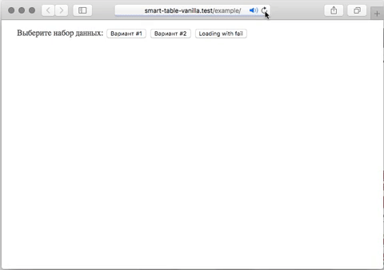

### Test work 20181022
Async data loader + Smart table example, based on VanillaJS

Please, open [./example/index.html](./example/index.html)

### Based on smart-table-vanilla
smart table binding for vanilla javascript. A declarative HTML API to link your smart table to the DOM. 
More details at [Documentation website](https://smart-table.github.io/www/dist/)

See [online example](https://smart-table.github.io/smart-table-vanilla/example/)
